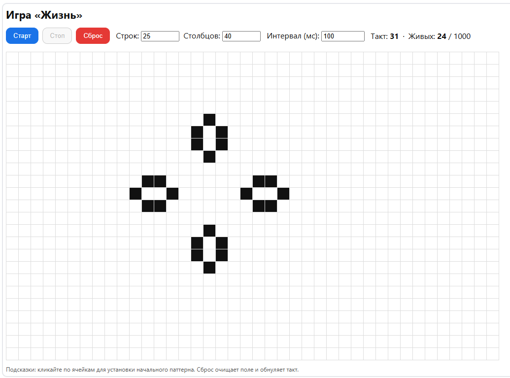
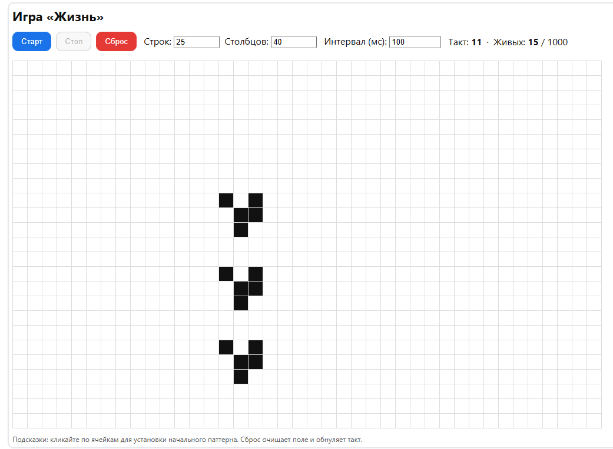

# Игра «Жизнь»

Веб-реализация клеточного автомата **Game of Life** с использованием фреймворка **Vue.js 3**.

Проект создан для учебных и демонстрационных целей.

---

## 📋 Функциональность

* Поле клеток реализовано в виде таблицы (`<table>`).
* Кликабельные ячейки для ручной расстановки живых клеток.
* Кнопки управления:

  * **Старт** — запускает симуляцию.
  * **Пауза** — останавливает текущий цикл.
  * **Сброс** — очищает поле и обнуляет счётчики.
* Счётчики:

  * **Такт игры** (номер поколения).
  * **Количество живых клеток** и общее количество.
* Возможность изменения размеров поля (строки × столбцы).
* Настройка интервала такта (мс).

---

## 🛠️ Технологии

* **HTML5** — разметка.
* **CSS3** — стилизация (вынесены в отдельный файл `style.css`).
* **Vue.js 3** (CDN-подключение) — реактивность и логика игры.
* **JavaScript (ES6+)** — реализация клеточного автомата.

---

## 📂 Структура проекта

```
TheLifeGame/
│
├── index.html     # Основная страница с разметкой и Vue-кодом
├── style.css      # Файл со стилями
└── README.md      # Документация проекта
```

---

## 🚀 Запуск проекта

1. Скачайте или клонируйте проект:

   ```bash
   git clone https://github.com/MrFireDeN/TheLifeGame.git
   cd TheLifeGame
   ```
2. Откройте файл `index.html` в браузере.
   Никакой сборки или дополнительных зависимостей не требуется.

---

## 🎮 Управление

* **Клик по ячейке** — инверсия состояния (живая ↔ мёртвая).
* **Старт** — запускает эволюцию клеток по правилам Конвея.
* **Пауза** — приостанавливает игру.
* **Сброс** — очищает поле.
* **Поля ввода**:

  * Изменение количества строк и столбцов.
  * Настройка интервала такта (в миллисекундах).

---

## ⚙️ Правила игры Конвея

1. Живая клетка с менее чем 2 живыми соседями умирает.
2. Живая клетка с 2 или 3 соседями продолжает жить.
3. Живая клетка с более чем 3 соседями умирает.
4. Мёртвая клетка с ровно 3 соседями оживает.

---

## 🧮 Особенности реализации

* Игровое поле хранится как массив массивов `grid[row][col]`.
* Каждый ход (`tickGame`) выполняется через:

  ```js
  t = setTimeout(tickGame, delayMs);
  ```

* Пауза — `clearTimeout(t)`.
* Сброс — остановка таймера и очистка массива.

---

## 📸 Скриншоты




---

## 📖 Лицензия

Проект распространяется под лицензией **MIT**.
Вы можете свободно использовать, изменять и распространять код.